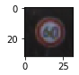
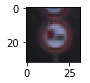
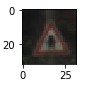
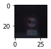
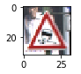

#**Traffic Sign Recognition** 

**Build a Traffic Sign Recognition Project**

The goals / steps of this project are the following:
* Load the data set (see below for links to the project data set)
* Explore, summarize and visualize the data set
* Design, train and test a model architecture
* Use the model to make predictions on new images
* Analyze the softmax probabilities of the new images
* Summarize the results with a written report

###Writeup / README

My project code is here [project code](Traffic_Sign_Classifier.ipynb)

###Data Set Summary & Exploration

####1. Provide a basic summary of the data set. In the code, the analysis should be done using python, numpy and/or pandas methods rather than hardcoding results manually.

I used the numpy library to calculate summary statistics of the traffic
signs data set:

* The size of training set is 34799
* The size of the validation set is 4410
* The size of test set is 12630
* The shape of a traffic sign image is 32x32
* The number of unique classes/labels in the data set is 43

####2. Include an exploratory visualization of the dataset.
For example, the traffic sign is shown as:

Here is an exploratory visualization of the data set. It is a bar chart showing the data histrogram corresponding to each traffic sign:

###Design and Test a Model Architecture

####1. In order to pass the training data to the train architecture, first I normalized the image data because it will help for better and faster optimization convergence. After normalization, each feature value will range between [-1,+1]. The formular for feature normalization is given by
X_norm = (X/122.5) - 1

####2. Describe what your final model architecture looks like including model type, layers, layer sizes, connectivity, etc.) Consider including a diagram and/or table describing the final model.

My final model consisted of the following layers:

|  Layer Number  |        Function     		|              Description	        					        | 
|:--------------:|:---------------------:|:---------------------------------------------:| 
| 1              | Input                 | 32x32x3 RGB image   						                   	| 
|                | Convolution 7x7     	 | 1x1 stride, valid padding, outputs 26x26x32  	|
|                | RELU	Activation   				|	-											                                  |
|                | Max pooling	         	| 2x2 stride,  outputs 13x13x32 				            |
|:--------------:|:---------------------:|:---------------------------------------------:| 
| 2              | Convolution 6x6	      | 1x1 stride, valid padding, outputs 8x8x32   		|
|                | RELU	Activation   				|	-											                                  |
|                | Max pooling	         	| 2x2 stride,  outputs 4x4x32 				              |
|                | Flattening 	         	| outputs 512 				                              |
|:--------------:|:---------------------:|:---------------------------------------------:|
| 3              | Fully connected	     	| logits = XW + b, 512x120 weight, outputs 120  |
|                | RELU	Activation 	     | - 				                                        |
|:--------------:|:---------------------:|:---------------------------------------------:|
| 4              | Fully connected	     	| logits = XW + b, 120x84 weight, outputs 84.   |
|                | RELU	Activation 	     | - 				                                        |
|:--------------:|:---------------------:|:---------------------------------------------:|
| 5              | Fully connected	     	| logits = XW + b, 84x43 weight, outputs 43.    |
 

####3. Describe how you trained your model. The discussion can include the type of optimizer, the batch size, number of epochs and any hyperparameters such as learning rate.

In order to train the model, first the loss function is chosen as sum of square error. The Adam optimizer is chosen in this project due to its benefit of larger effective step size compared to gradient descent. The downside is this type of optimizer may require more computation. Increasing number of epochs will increase the training time as well as the training model accuracy. The final validation model accuracy is >93%. Learning rate is set to be at 0.001 after several trial and error. Some larger learning, i.e. 0.01, 0.1, can result in divergence of the optimal solution. 

####4. Describe the approach taken for finding a solution and getting the validation set accuracy to be at least 0.93. Include in the discussion the results on the training, validation and test sets and where in the code these were calculated. Your approach may have been an iterative process, in which case, outline the steps you took to get to the final solution and why you chose those steps. Perhaps your solution involved an already well known implementation or architecture. In this case, discuss why you think the architecture is suitable for the current problem.

First, I set the learning rate of 0.001, batch size = 128. The first step I tuned is the convolutional filter size. After several tuning iteration, my filter size and depth for both layer 1 and 2 are described in the model table. Small filter size in both layer 1 and 2 doesn't provide good model accuracy and the training time is quite long. 

My final model results were:
* training set accuracy of 100%
* validation set accuracy of 95.1%
* test set accuracy of 93.95%

If an iterative approach was chosen:
* What was the first architecture that was tried and why was it chosen?
- The first archietecture (Default LeNet architecture from previous example of traffic sign classification before this project) does not achieve the model accuracy requirement. The model accuracy is ~90% which is closed enough, therefore, this LeNet architecture is chosen as a starting point.

* What were some problems with the initial architecture?
- The initial archiecture actually performs reasonable well already except possible unoptimized predefined model parameters which may optimal tuning process.

* How was the architecture adjusted and why was it adjusted? Typical adjustments could include choosing a different model architecture, adding or taking away layers (pooling, dropout, convolution, etc), using an activation function or changing the activation function. One common justification for adjusting an architecture would be due to overfitting or underfitting. A high accuracy on the training set but low accuracy on the validation set indicates over fitting; a low accuracy on both sets indicates under fitting.
- The filter size inside the convolutional layer 1 and 2 are adjusted while keeping the same 5 layer architecture as our baseline. Also, the activation function is also tried, such as relu vs elu, but the model accuracy result is relatively the same. Based on the current model result, the model tends to overfitting since the train model accuracy is high, but low accuracy shown in validation set. Reducing the number of model parameters, i.e. number of layers, filter size, max_pooling setting, should result in decrease number of model paramameters to avoid overfitting problem.

* Which parameters were tuned? How were they adjusted and why?
- Learning rate and number of epochs are tuned. Learnign rate is tuned iteratively so that the final learning rate is set to be 0.001. Higher learning rate, i.e. 0.1, 0.01, result in divegence of optimal solution. Number of epochs is tuned to be 60 since at this number the traning model accuracy is relatively unchanged. Larger number of epochs does not improve model accuracy, instead the traning computation time is increased which is undesirable. 

* What are some of the important design choices and why were they chosen? For example, why might a convolution layer work well with this problem? How might a dropout layer help with creating a successful model?
- The convolutation layer will be beneficial to this problem since it help decrease number of model free paramters. Shallow forward neural networks tends to perform poorer compared to deep convolutional neural network. The dropout layer will definitely help to even half decrease in size of the feature width and height, but deeper in depth. 

###Test a Model on New Images

####1. Choose five German traffic signs found on the web and provide them in the report. For each image, discuss what quality or qualities might be difficult to classify.

Here are five German traffic signs that I found on the web:

  
 

For some cases, these image maybe difficult to be classified since the preprocessing data is only utilized the normalization technique. Other techniques such as grayscale, image shift and rotation, and other augmentation technique can improve the better quality of training data as well.

####2. Discuss the model's predictions on these new traffic signs and compare the results to predicting on the test set. At a minimum, discuss what the predictions were, the accuracy on these new predictions, and compare the accuracy to the accuracy on the test set (OPTIONAL: Discuss the results in more detail as described in the "Stand Out Suggestions" part of the rubric).

Here are the results of the prediction:

| Image			        |     Prediction	        					| 
|:---------------------:|:---------------------------------------------:| 
| Speed limit (60 km/h)      		                  | Speed limit (60 km/h)   									| 
| No passing for vehicles over 3.5 metric tons   | No passing for vehicles over 3.5 metric tons 										|
| Right-of-way at the next intersection					     | Right-of-way at the next intersection											|
| No passing for vehicles over 3.5 metric tons	  | No passing for vehicles over 3.5 metric tons					 				|
| Slippery road			                               | Slippery road      							|

The model was able to correctly guess 5 of the 5 traffic signs, which gives an accuracy of 100%. This compares favorably to the accuracy on the test set of 93.95%

####3. Describe how certain the model is when predicting on each of the five new images by looking at the softmax probabilities for each prediction. Provide the top 5 softmax probabilities for each image along with the sign type of each probability. (OPTIONAL: as described in the "Stand Out Suggestions" part of the rubric, visualizations can also be provided such as bar charts)

The code for making predictions on my final model is located in the 11th cell of the Ipython notebook.

For the first image, the model is relatively sure that this is a stop sign (probability of ~1), and the image does contain a stop sign. The top five soft max probabilities were

| Probability         	|     Prediction	        					| 
|:---------------------:|:---------------------------------------------:| 
| ~1         			       | (3) Speed limit (60km/h)   									| 
| 1.13894918e-11     		| (5) Speed limit (80km/h) 										|
| 1.43209328e-25					  | (10) No passing for vehicles over 3.5 metric tons											|
| 4.10083053e-31	      | (23) Slippery road					 				|
| 1.95998884e-31				   | (36) Go straight or right      							|

For the second image ... 

### (Optional) Visualizing the Neural Network (See Step 4 of the Ipython notebook for more details)
####1. Discuss the visual output of your trained network's feature maps. What characteristics did the neural network use to make classifications?
-

